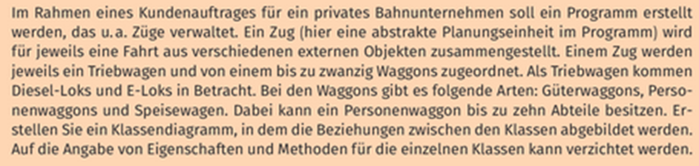

# Implementierung des Beispiels



- Was sind die Objekte? Zug, Triebwagen, Waggon, Diesel-Lok, E-Lok, Güterwaggon, Personenwaggon, Speisewagen, Abteil
- Das sind die Klassen, setze diese jetzt in Beziehung
- Zug besteht aus Waggons und Triebwagen (Teil-Ganzes-Beziehung)
- Diesel-Lok und E-Lok sind spezielle Triebwagen, daher erben sie von der Klasse Triebwagen
- Ebenso Gütterwaggon, Personenwaggon, Speisewagen
- Das Abteil kann nur mit Personenwaggon bestehen (starke Teil-Ganzes-Beziehung)

Implementierungsschritte:

1. Definition der Klassen
    
    Wir definieren zuerst die Klassen **`Zug`**, **`Triebwagen`**, **`DieselLok`**, **`ELok`**, **`Waggon`**, **`Gueterwaggon`**, **`Personenwaggon`**, **`Speisewagen`** und **`Abteil`**. Jede dieser Klassen repräsentiert einen bestimmten Typ von Eisenbahnkomponenten.
    
    ```python
    class Zug:
      
    class Triebwagen:
    
    class DieselLok:
      
    class Elok:
      
    class Waggon:
      
    class Gueterwaggon:
      
    class Personenwaggon:
      
    class Speisewagen:
      
    class Abteil:
    ```
    
2. Klasse Zug:
    - Die Klasse **`Zug`** hat eine Konstruktor-Methode **`__init__`**, die den Namen des Zuges als Parameter erwartet und eine Liste von Waggons (**`waggons`**) sowie einen Triebwagen (**`triebwagen`**) initialisiert. Ein Zug kann aus mehreren Waggons bestehen, aber nur einen Triebwagen haben.
    - Die Methode **`add_waggon`** ermöglicht es, einen Waggon zum Zug hinzuzufügen.
    - Die Methode **`set_triebwagen`** ermöglicht es, einen Triebwagen für den Zug festzulegen.
    
    ```python
    class Zug:
        def __init__(self, name):
            self.name = name
            self.waggons = []
            self.triebwagen = None
        def add_waggon(self, waggon):
            self.waggons.append(waggon)
    
        def set_triebwagen(self, triebswagen):
            self.triebwagen = triebswagen
    ```
    
3. Klasse Triebwagen
    
    Die Klasse **`Triebwagen`** repräsentiert einen allgemeinen Typ von Triebwagen und hat eine Konstruktor-Methode **`__init__`**, die den Namen des Triebwagens erwartet.
    
    class Triebwagen:
    def **init**(self, name):
    [self.name](http://self.name/) = name
    
4. Klasse DieselLok, ELok
    
    Die Klassen **`DieselLok`** und **`ELok`** sind spezielle Arten von Triebwagen und erben von der Klasse **`Triebwagen`**. Das bedeutet, dass sie alle Eigenschaften und Methoden der **`Triebwagen`**-Klasse erben, können aber auch zusätzliche Eigenschaften oder Methoden haben, wenn nötig.
    
    ```python
    class DieselLok(Triebwagen):
        def __init__(self, name):
            super().__init__(name)
    
    class ELok(Triebwagen):
        def __init__(self, name):
            super().__init__(name)
    ```
    
5. Klasse Waggon
    
    Die Klasse **`Waggon`** repräsentiert einen allgemeinen Typ von Waggon und hat eine Konstruktor-Methode **`__init__`**, die den Namen des Waggons erwartet.
    
    ```python
    class Waggon:
        def __init__(self, name):
            self.name = name
    ```
    
6. Klassen Gueterwaggon, Personenwaggon, Speisewagen
    
    Die Klassen **`Gueterwaggon`**, **`Personenwaggon`** und **`Speisewagen`** sind spezielle Arten von Waggons und erben von der Klasse **`Waggon`**. Sie können zusätzliche Eigenschaften oder Methoden haben, die spezifisch für ihren Typ sind.
    
    ```python
    class Gueterwaggon(Waggon):
        def __init__(self, name):
            super().__init__(name)
    
    class Personenwaggon(Waggon):
        def __init__(self, name):
            super().__init__(name)
            self.abteile = []
    
        def add_abteil(self, abteil):
            self.abteile.append(abteil)
    
    class Speisewagen(Waggon):
        def __init__(self, name):
            super().__init__(name)
    ```
    
7. Klasse Abteil
    
    Die Klasse **`Abteil`** repräsentiert ein Abteil in einem Personenwaggon und hat eine Konstruktor-Methode **`__init__`**, die den Namen des Abteils erwartet.
    
    ```python
    class Abteil:
        def __init__(self, name):
            self.name = name
    ```
    
8. Beispiel-Nutzung
    - Im Beispiel werden Instanzen dieser Klassen erstellt, um einen Zug zu modellieren. Ein Zug wird mit einem Namen erstellt, und ein Triebwagen wird hinzugefügt. Es werden verschiedene Arten von Waggons, einschließlich Gueterwaggons, Personenwaggons und Speisewaggons, erstellt und zum Zug hinzugefügt.
    - Für Personenwaggons werden auch Abteile erstellt und hinzugefügt.
    - Schließlich wird der Name des Zuges, der Triebwagen und die Waggons ausgegeben, wobei für Personenwaggons auch die Abteile aufgelistet werden.
    
    ```python
    zug1 = Zug("Schnellzug")
    triebwagen1 = DieselLok("Diesel-Triebwagen")
    zug1.set_triebwagen(triebwagen1)
    
    waggon1 = Gueterwaggon("G1")
    waggon2 = Personenwaggon("P1")
    waggon3 = Personenwaggon("P2")
    waggon4 = Speisewagen("S1")
    
    abteil1 = Abteil("Abteil1")
    abteil2 = Abteil("Abteil2")
    
    waggon2.add_abteil(abteil1)
    waggon2.add_abteil(abteil2)
    
    zug1.add_waggon(waggon1)
    zug1.add_waggon(waggon2)
    zug1.add_waggon(waggon3)
    zug1.add_waggon(waggon4)
    
    print("Zugname:", zug1.name)
    print("Triebwagen:", zug1.triebwagen.name)
    print("Waggons:")
    for waggon in zug1.waggons:
        print("-", waggon.name)
        if isinstance(waggon, Personenwaggon):
            print("  Abteile:")
            for abteil in waggon.abteile:
                print("  -", abteil.name)
    ```
    

## Aufgabe

Wir wollen uns zunächst eine kleine Anwendung schreiben. In dieser Anwendung wollen wir Zugtickets buchen können. 

Unseren bestehenden Code erweitern wir um ein paar weitere Informationen. 

1. Zunächst einmal bekommt unsere Klasse Zug eine toString()-Methode:
    
    ```python
    def __str__(self):
            return f"Zug {self.name} mit {len(self.waggons)} Waggons und Triebwagen {self.triebwagen.name}"
    ```
    
2. Als nächstes modifizieren wir die Klasse der Personenwaggons. Wir fügen die Eigenschaft freiePlätze hinzu.
    
    ```python
    class Personenwaggon(Waggon):
        def __init__(self, name):
            super().__init__(name)
            self.abteile = []
            self.freie_plaetze = 0
    ```
    
3. Außerdem wird die Funktion hinzugefügt, dass Tickets gebucht werden können.
    
    ```python
    def buche_ticket(self):
            if self.freie_plaetze > 0:
                self.freie_plaetze -= 1
                return True
            else:
                return False
    ```
    
4. Ferner wird die add_abteil Funktion erweitert:
    
    ```python
    def add_abteil(self, abteil):
            self.abteile.append(abteil)
            self.freie_plaetze += abteil.plaetze
    ```
    
5. Zuletzt wird die Klasse Abteil angepasst
    
    ```python
    class Abteil:
        def __init__(self, name, plaetze):
            self.name = name
            self.plaetze = plaetze
    ```
    
6. Wir führen das mit folgendem Beispiel-Code mal aus..
    
    Später wollen wir uns eine UI schreiben, mit der wir so eine Anwendung beispielsweise implementieren können. Ich habe den Code mal beispielhaft dazu gepackt. Eine Implementierung der Buttons ist noch nicht drin.. Dürft euch das gerne schon mal ansehen.
    
    ```python
    class Zug:
        def __init__(self, name):
            self.name = name
            self.waggons = []
            self.triebwagen = None
        def add_waggon(self, waggon):
            self.waggons.append(waggon)
    
        def set_triebwagen(self, triebswagen):
            self.triebwagen = triebswagen
    
        def __str__(self):
            return f"Zug {self.name} mit {len(self.waggons)} Waggons und Triebwagen {self.triebwagen.name}"
      
    class Triebwagen:
        def __init__(self, name):
            self.name = name
    
    class DieselLok(Triebwagen):
        def __init__(self, name):
            super().__init__(name)
    
    class ELok(Triebwagen):
        def __init__(self, name):
            super().__init__(name)
      
    class Waggon:
        def __init__(self, name):
            self.name = name
      
    class Gueterwaggon(Waggon):
        def __init__(self, name):
            super().__init__(name)
    
    class Personenwaggon(Waggon):
        def __init__(self, name):
            super().__init__(name)
            self.abteile = []
            self.freie_plaetze = 0
    
        def add_abteil(self, abteil):
            self.abteile.append(abteil)
            self.freie_plaetze += abteil.plaetze
        
        def buche_ticket(self):
            if self.freie_plaetze > 0:
                self.freie_plaetze -= 1
                return True
            else:
                return False
    
    class Speisewagen(Waggon):
        def __init__(self, name):
            super().__init__(name)
      
    class Abteil:
        def __init__(self, name, plaetze):
            self.name = name
            self.plaetze = plaetze
            
    # Beispiel-Nutzung:
    
    # Erstellen von Zügen, Triebwagen, Waggons und Abteilen
    zug1 = Zug("Schnellzug")
    triebwagen1 = DieselLok("Diesel-Triebwagen")
    zug1.set_triebwagen(triebwagen1)
    
    waggon1 = Gueterwaggon("G1")
    waggon2 = Personenwaggon("P1")
    waggon3 = Personenwaggon("P2")
    waggon4 = Speisewagen("S1")
    
    abteil1 = Abteil("Abteil1", 4)
    abteil2 = Abteil("Abteil2", 6)
    
    waggon2.add_abteil(abteil1)
    waggon2.add_abteil(abteil2)
    
    zug1.add_waggon(waggon1)
    zug1.add_waggon(waggon2)
    zug1.add_waggon(waggon3)
    zug1.add_waggon(waggon4)
    
    # Buchung von Tickets für Abteile im Personenwaggon
    if waggon2.buche_ticket():
        print("Ticket für Abteil1 gebucht.")
    else:
        print("Abteil1 ausgebucht.")
    if waggon2.buche_ticket():
        print("Ticket für Abteil2 gebucht.")
    else:
        print("Abteil2 ausgebucht.")
    if waggon2.buche_ticket():
        print("Ticket für Abteil2 gebucht.")
    else:
        print("Abteil2 ausgebucht.")
    
    # Anzeigen der Informationen über den Zug und Waggons
    print(zug1)
    print("Waggons im Zug:")
    for waggon in zug1.waggons:
        if isinstance(waggon, Personenwaggon):
            print(f"- {waggon.name} mit {len(waggon.abteile)} Abteilen ({waggon.freie_plaetze} freie Plätze)")
        else:
            print(f"- {waggon.name}")
    
    import tkinter as tk
    from tkinter import messagebox
    
    # Hier fügen Sie Ihre Klassen und Methoden aus Ihrem vorherigen Code ein
    
    # Funktion zur Buchung eines Tickets
    def buche_ticket():
        success = waggon2.buche_ticket()
        if success:
            messagebox.showinfo("Buchung erfolgreich", "Ticket erfolgreich gebucht.")
        else:
            messagebox.showwarning("Buchung fehlgeschlagen", "Das Abteil ist ausgebucht.")
    
    # Erstellung des Hauptfensters
    root = tk.Tk()
    root.title("Zugbuchung")
    
    # Labels und Schaltflächen zur Benutzeroberfläche hinzufügen
    label = tk.Label(root, text="Willkommen zur Zugbuchung")
    label.pack(pady=10)
    
    buchung_button = tk.Button(root, text="Ticket buchen", command=buche_ticket)
    buchung_button.pack(pady=5)
    
    info_label = tk.Label(root, text="Informationen zum Zug:")
    info_label.pack(pady=5)
    
    info_text = tk.Text(root, height=10, width=40)
    info_text.pack()
    
    # Funktion zur Anzeige von Informationen
    def zeige_informationen():
        zug_info = str(zug1) + "\nWaggons im Zug:\n"
        for waggon in zug1.waggons:
            if isinstance(waggon, Personenwaggon):
                zug_info += f"- {waggon.name} mit {len(waggon.abteile)} Abteilen ({waggon.freie_plaetze} freie Plätze)\n"
            else:
                zug_info += f"- {waggon.name}\n"
        info_text.delete(1.0, tk.END)
        info_text.insert(tk.END, zug_info)
    
    info_button = tk.Button(root, text="Zeige Informationen", command=zeige_informationen)
    info_button.pack(pady=5)
    
    # Funktion zum Beenden der Anwendung
    def beenden():
        root.destroy()
    
    beenden_button = tk.Button(root, text="Beenden", command=beenden)
    beenden_button.pack(pady=5)
    
    # Starten der GUI
    root.mainloop()
    ```
